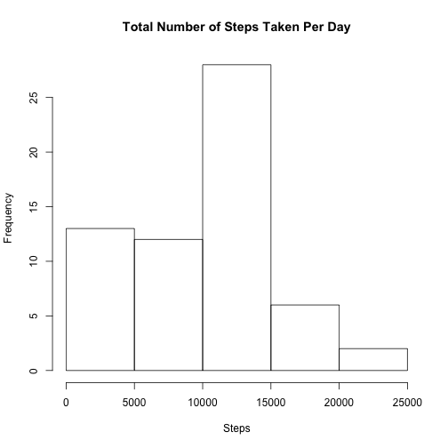
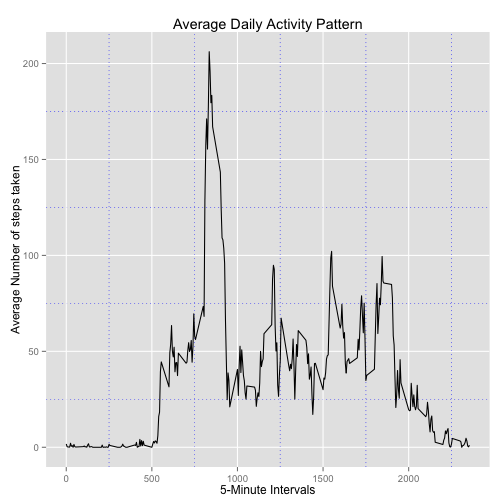
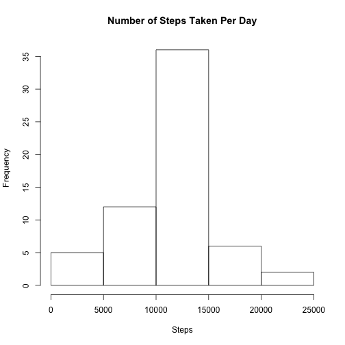
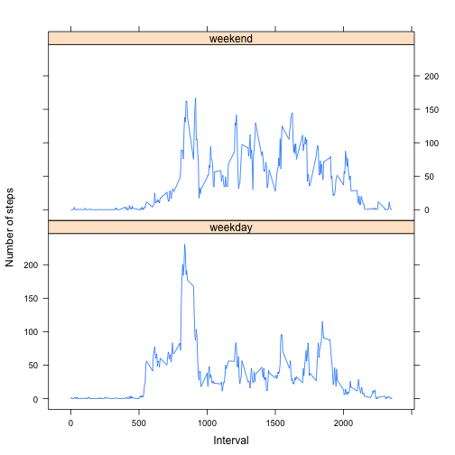

title: "Reproducible Research: Peer Assessment 1"
output: 
  html_document:
    keep_md: true
---


## Loading and preprocessing the data

Showing code that is required to load the data into the directory

```r
activitydf <- read.csv('~/Downloads/activity.csv', sep = ',', header = TRUE)
```
Good to see if the data has actually loaded

```r
head(activitydf)
```

```
##   steps       date interval
## 1    NA 2012-10-01        0
## 2    NA 2012-10-01        5
## 3    NA 2012-10-01       10
## 4    NA 2012-10-01       15
## 5    NA 2012-10-01       20
## 6    NA 2012-10-01       25
```

Then we take time to view the structure of the loaded data

```r
str(activitydf)
```

```
## 'data.frame':	17568 obs. of  3 variables:
##  $ steps   : int  NA NA NA NA NA NA NA NA NA NA ...
##  $ date    : Factor w/ 61 levels "2012-10-01","2012-10-02",..: 1 1 1 1 1 1 1 1 1 1 ...
##  $ interval: int  0 5 10 15 20 25 30 35 40 45 ...
```
## What is mean total number of steps taken per day?

Make a histogram of the total number of steps taken each day

We need to load the dplyr package to so as to access the group_by function which will help us group the data by date

```r
library(dplyr)
```

To calculate the total number of steps taken per day, we first group the data by date, then summarise it with the sum function.

```r
perday <- activitydf %>%
        group_by(date = as.Date(date)) %>%
        summarise(steps = sum(steps, na.rm = TRUE))
```
We can then plot a histogram after grouping the data

```r
hist(perday$steps, main = "Total Number of Steps Taken Per Day", xlab = "Steps")     
```

 

The we can calculate and report the mean and median of the total number of steps taken per day


```r
mean(perday$steps, na.rm = TRUE)
```

```
## [1] 9354.23
```

```r
median(perday$steps, na.rm = TRUE)
```

```
## [1] 10395
```


## What is the average daily activity pattern?

###### Make a time series plot (i.e. type = "l") of the 5-minute interval (x-axis) and the average number of steps taken, averaged across all days (y-axis)

First we group the data by interval, then summarise it on the steps variable by its mean and save it into a new object

```r
avgsteps <- activitydf %>%
        group_by(interval) %>%
        summarise(steps = mean(steps, na.rm = TRUE))
```
From here its easy to plot the graph of the result in the new object.
But first we call the plotting graph device ggplot

```r
library(ggplot2)
```
Then we are able to plot the result using the ggplot graph ploting device

```r
ggplot(avgsteps, aes(interval, steps)) + geom_line() + 
        labs(title = "Average Daily Activity Pattern" ) +
        xlab("5-Minute Intervals") + 
        ylab("Average Number of steps taken") + 
        theme(panel.grid.minor = element_line(colour = "blue", linetype = "dotted"))
```

 
Which 5-minute interval, on average across all the days in the dataset, contains the maximum number of steps?

```r
avgsteps$interval[which.max(avgsteps$steps)]
```

```
## [1] 835
```

## Imputing missing values

###### Calculate and report the total number of missing values in the dataset (i.e. the total number of rows with NAs)

```r
sum(is.na(activitydf$steps))
```

```
## [1] 2304
```

```r
sum(is.na(activitydf$date))
```

```
## [1] 0
```

```r
sum(is.na(activitydf$interval))
```

```
## [1] 0
```
Devise a strategy for filling in all of the missing values in the dataset. The strategy does not need to be sophisticated. 
For example, you could use the mean/median for that day, or the mean for that 5-minute interval, etc.

```r
newsteps <- data.frame(activitydf$steps)
newsteps[is.na(newsteps),] <- ceiling(tapply(X=activitydf$steps,INDEX=activitydf$interval,FUN=mean,na.rm=TRUE))
```
Create a new dataset that is equal to the original dataset but with the missing data filled in.

```r
newdf <- cbind(newsteps, activitydf[,2:3])
colnames(newdf) <- c("Steps", "Date", "Interval")
```
Make a histogram of the total number of steps taken each day and Calculate and report the mean and median total number 
of steps taken per day.

Frist group by date and summariseon steps

```r
newdata <- newdf %>%
        group_by(Date = as.Date(Date)) %>%
        summarise(Steps = sum(Steps, na.rm = TRUE))
```

then plot the hist

```r
hist(newdata$Steps, main = "Number of Steps Taken Per Day", xlab = "Steps")     
```

 
After which, we calculate and report the mean and median total number of steps taken per day.

```r
mean(newdata$Steps)
```

```
## [1] 10784.92
```

```r
median(newdata$Steps)
```

```
## [1] 10909
```
###### Do these values  differ from the estimates from the first part of the assignment? 
Yes, as shown above and below the values do differ

2nd mean  10784.92 & 1st Mean 9354.23
2nd meadian 10909 &   1st meadian 10395

###### What is the impact of imputing missing data on the estimates of the total daily number of steps?
There is some slight difference in the distribution of the data however the impact is not so big


## Are there differences in activity patterns between weekdays and weekends?

###### Create a new factor variable in the dataset with two levels – “weekday” and “weekend”  
indicating whether a given date is a weekday or weekend day.

We shall use the lubridate package to help subset between weekday and weekend

```r
library(lubridate)
```
Then we create a new collumn using the mutate fuction from the dplyr package to help create the factor variable

```r
newdf4 <-newdf %>% 
        mutate(DayType = as.factor(ifelse(wday(Date) %in% c(1,7),"weekend","weekday")))
```
###### Make a panel plot containing a time series plot (i.e. type = "l") of the 5-minute interval (x-axis) and the average 
number of steps taken, averaged across all weekday days or weekend days (y-axis). See the README file in the GitHub repository
to see an example of what this plot should look like using simulated data.

We shall use the lattice plotting device

```r
library("lattice")
```

Then we create a new object in which we group the and then summarise it on the means of the steps variable


```r
newdf5 <- newdf4 %>% 
group_by(DayType,Interval) %>%
        summarise(avgsteps=mean(Steps))
```

The result of the above object is what we plot in the xyplot to show a distinction between weekdays and weekends steps

```r
with (newdf5, 
      xyplot(avgsteps ~ Interval|DayType, type="l", 
             ylab="Number of steps",layout=c(1,2)))
```

 
